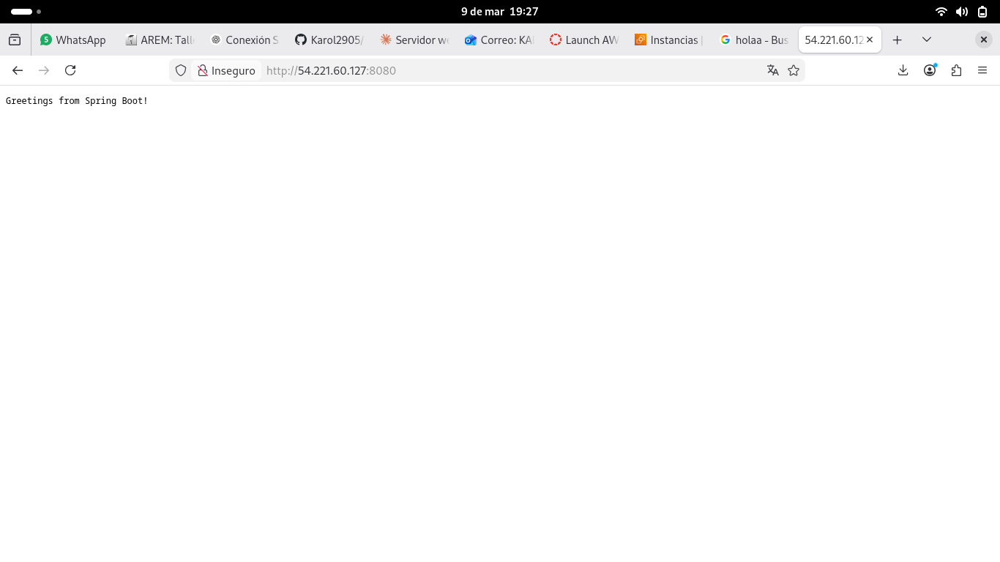
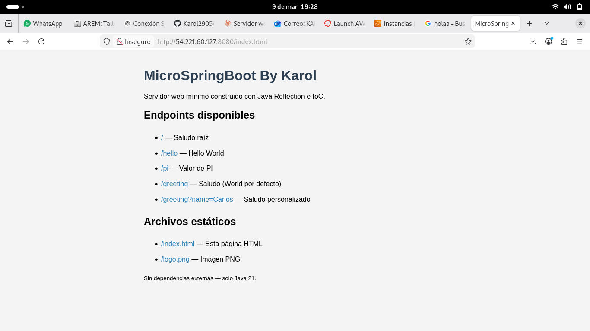
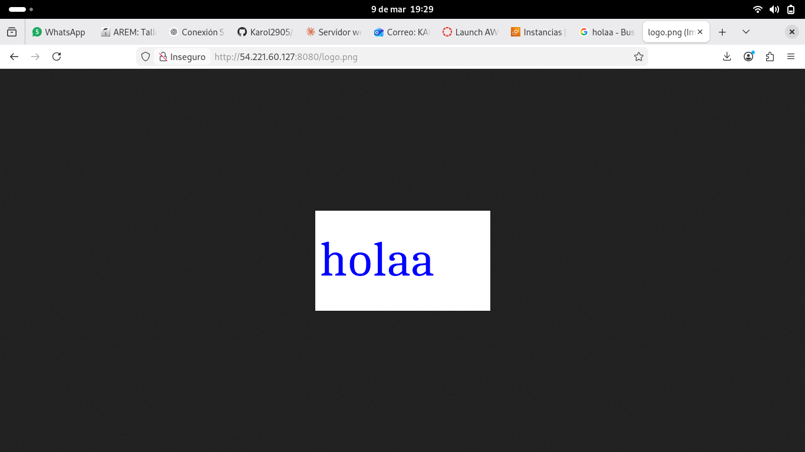

# MicroSpringBoot

Un servidor web mínimo en Java que demuestra las capacidades reflexivas del lenguaje e implementa un framework IoC (Inversion of Control) para construir aplicaciones web a partir de POJOs.

## Descripción

Este proyecto implementa desde cero un servidor HTTP capaz de:
- Entregar páginas HTML e imágenes PNG (archivos estáticos)
- Cargar y registrar controladores REST usando reflexión en tiempo de ejecución
- Soportar las anotaciones `@RestController`, `@GetMapping` y `@RequestParam`
- Escanear automáticamente el classpath buscando componentes anotados
- Atender múltiples solicitudes no concurrentes en el puerto 8080

## Arquitectura

```
MicroSpringBoot/
├── src/main/java/org/example/
│   ├── MicroSpringBoot.java       # Servidor HTTP principal + IoC container
│   ├── HelloController.java       # Controlador de ejemplo
│   ├── GreetingController.java    # Controlador con @RequestParam
│   ├── RestController.java        # Anotación @RestController
│   ├── GetMapping.java            # Anotación @GetMapping
│   ├── RequestParam.java          # Anotación @RequestParam
│   ├── RunTests.java              # Framework de testing por reflexión
│   ├── Foo.java                   # Clase de prueba con @Test
│   ├── Test.java                  # Anotación @Test
│   ├── InvokeMain.java            # Invocador de main por reflexión
│   └── ReflexionNavigator.java    # Explorador de miembros por reflexión
└── src/main/resources/static/
    ├── index.html                 # Página HTML de inicio
    └── logo.png                   # Imagen PNG de ejemplo
```

## Prerrequisitos

- Java 21
- Maven 3.x (opcional, se puede compilar con `javac`)

## Compilación y ejecución local

### Con Maven
```bash
mvn compile
cp -r src/main/resources/static target/classes/
java -cp target/classes org.example.MicroSpringBoot
```

### Sin Maven
```bash
javac -d target/classes $(find src/main/java -name "*.java")
cp -r src/main/resources/static target/classes/
java -cp target/classes org.example.MicroSpringBoot
```

### Pasar un controlador específico por argumento
```bash
java -cp target/classes org.example.MicroSpringBoot org.example.HelloController
```

## Endpoints disponibles

| Método | URL | Descripción |
|--------|-----|-------------|
| GET | `http://localhost:8080/` | Saludo raíz |
| GET | `http://localhost:8080/hello` | Hello World |
| GET | `http://localhost:8080/pi` | Valor de PI |
| GET | `http://localhost:8080/greeting` | Saludo con nombre por defecto (World) |
| GET | `http://localhost:8080/greeting?name=Carlos` | Saludo con nombre personalizado |
| GET | `http://localhost:8080/index.html` | Página HTML estática |
| GET | `http://localhost:8080/logo.png` | Imagen PNG estática |

## Ejemplo de controlador

```java
@RestController
public class GreetingController {

    @GetMapping("/greeting")
    public static String greeting(@RequestParam(value = "name", defaultValue = "World") String name) {
        return "Hola " + name;
    }
}
```

## Framework de testing (reflexión)

El proyecto también incluye un mini framework de pruebas basado en reflexión, similar a JUnit:

```bash
java -cp target/classes org.example.RunTests org.example.Foo
```

Salida esperada:
```
Test m3() failed: java.lang.RuntimeException: Boom
Test m7() failed: java.lang.RuntimeException: Crash
Passed: 2, Failed 2
```

## Cómo funciona el IoC (Reflexión)

1. **Escaneo**: `MicroSpringBoot` recorre todas las clases del classpath en el paquete `org.example`
2. **Detección**: Usando `Class.isAnnotationPresent(RestController.class)` identifica los controladores
3. **Registro**: Lee cada método con `@GetMapping` y guarda la ruta → método en un `HashMap`
4. **Instanciación**: Crea una instancia del POJO con `getDeclaredConstructor().newInstance()`
5. **Invocación**: Al recibir una petición HTTP, invoca el método con `Method.invoke()` resolviendo los `@RequestParam` del query string

## Despliegue en AWS


### Evidencia de despliegue en AWS

> **Instancia EC2 corriendo**


---

> **Endpoints respondiendo desde la IP pública de AWS**




---

> **Endpoint `/greeting?name=Karol` desde AWS**


---

> 📸 **Archivos estáticos**




